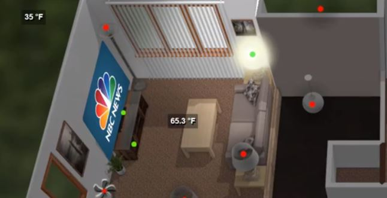

# now-playing-card

**PLEASE NOTE:  HA 110 Breaks this card.  It is currently only working with versions before .110 !!!**

Custom card for [Home Assistant](https://www.home-assistant.io/) to display a poster of the currently playing item in designated media_player.

#### Demo: [Youtube video](https://youtu.be/1ZU4WMgwU6s)

This works with those media_player entities supporting the entity_picture attribute.   Roku, Kodi, and Amazon Echo Dot all seem to work well for me.

The card is stackable, so you can position cards from several media players in the same spot to show whichever one is playing.

The card only shows the entity_picture while the status is playing.  This is because some roku players and echo dots will show images even when not actively playing media content.  It should be easy to edit this function out if you don't want it.

#### Known issues: 
Transform is highly dependent on the image size, so if you attempt to display an image of a different size (this can happen in kodi) the transform will not work correctly and the image will look weird or in the wrong place. 

If you use an old browser that doesn't display transform css properly, transform just won't work.

------------

#### entity
(string)(Required)

Entity id
 
&nbsp;
  
  
#### off_image
(string)(optional)

Optional Image to display when idle.  This must be the same size as the media image if using transform.

------------

## Example Usage

          - type: "custom:now-playing-poster"
            entity: media_player.dot_lr  
            style:
              width: 10%
              top: 20%
              left: 9%
              transform: rotate(-76deg) rotateX(-57deg) skewX(-25deg)              
                      
              

              
              
              
# Installation
  
Installation is the same as any custom card.

1. Copy the file [now-playing-card.js](https://github.com/bradcrc/Now-Playing-Card) to your /config/www/js/ directory

2. Add the following to the resources area of your ui-lovelace.yaml

            - url: /local/js/now-playing-card.js
              type: js

Once the card is copied and referenced, you can just add the entry as listed above.   

Most likely you'll also want to move the image around your floorplan.  This can be accomplished with CSS.  A tool has been included to help figure out the skew and rotate values, it's not necessary to use this tool, but hopefully it makes things easier.  To use the tool just open rotate.html from the Design Tool folder, and then copy your floorplan image and media image to the folder, or enter a valid URL for those images.
